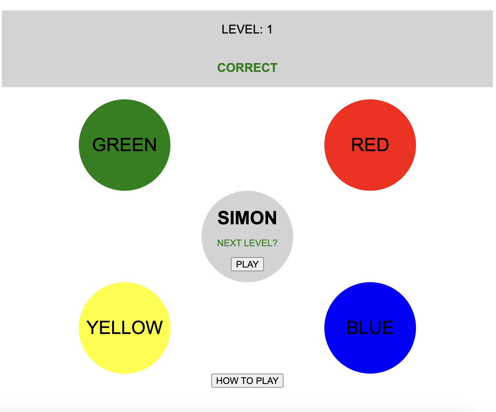

# Simon Game

## Description

This is a browser-based game Simon game. Simon is a memory-based game in which 'Simon' presses colors in a particular order, then the player presses those same colors in the same order. If the player succeeds at mimicking Simon, they may proceed into the next level where Simon will press one more color than the last level. If the player makes a mistake, they are forced to restart the game. This browser-based game is harkening back to the 80's handheld Hasbro game with the same/similar functionality.

## Technologies Used

- JavaScript
- HTML
- CSS

## Installation Instructions

- If you do not already have access to git commands refer to this link to install git on your device https://github.com/git-guides/install-git

- Clone this repository to your own local repository (terminal) using the SSH or HTML key ``git clone``
- Navigate into the new directory ``cd Simon-Game``
- Open the cloned files in Visual Studo code editor. `` code .``
- Navigate to the bottom right of your VS window and click the "Go Live" icon. 
- This will automatically redirect you to the local web browser game which you can use to view your edits using your VS code editor. 

## Planning Process

### User Stories

#### MVP Goals

- As a user, I want my button clicks for the color sections to be stored round to round, so that I can attempt to replicate the computer pattern.

- As a user, I want my button color clicks order compared to the random color order, so that I can advance to the next round or exit the game and start over

- As a user, I want the number of colors I'm supposed to replicate to increase by one each round, so that the game is challenging.

- As a user, I want the amount of levels I've completed to be tracked on the browser, so that I know how far I got at the end.

- As a user, I want the colors that are presented to replicate to be random, so that the game is not predictable.

- As a user I want the 'how to play' button to display game directions, so that I know the game progression and how to play.

- As a user I want to be diplayed a screen when I lose that shows me how far I made it and what I got wrong and takes the game back to it's original state, so I know where I messed up and how far I progessed

- As a user I want an obvious and clear indication for the buttons being selected to be replicated, so that I know exactly which buttons to push and don't miss the prompt.

#### Stretch Goals

# Bronze

- As a user, I want the lose screen and the how to play screen to be presented as modals, because they are more pleasing to the eye than prompts and alerts.

# Silver

- As a user, I want the game to track my highscore and present it in the lose modal, so that I know if I've beat my own record.

- As a user, I want to automatically be re-directed to the lose screen as soon as I get one color wrong, so I don't have to enter random colors if I don't know the answer.

# Gold

- As a user I want a sound attached to each button that will play when pressed by the user or selected at random to be replicated, so that I can enjoy the game with more senses, remember what was selected, and be more accessible.

- As a user I want the message that displays at the end of the game to be a random encouraging message, so that the sting of the loss is soothed and the game stays feeling fresh.

- As a user I want to choose the speed in which the buttons are indicated by difficulty level, so I can have more customization over my gameplay.

- As a user I want an option to play this game in a fashion accessible to screen readers, so that it's more accessible.

### Wireframes

## Major Hurdles

- I encountered a bug early on in my game play building that allowed the player to cheat by inputting their answers in tandem with 'Simon' inputting their answers. In order to solve it I had to employ some tricky timing functions and change where I was calling my comparison function from. It also lead me in the direction of disabling and enabling my buttons to lesson the ambiguity of game play.

## Unsolved Problems

- I'd like the You Lose Modal to be more sophisticated and reset the game without losing the game memory and reloading the page.
